<div align="center">

<a href="https://kevind003.github.io/KevinD003/">
  
</a>

### ▶ [**PLAY IT**](https://kevind003.github.io/KevinD003/) ◀

<sub>Not a screenshot, and not a stock widget — the level above **is my commit history**.<br>
Every pillar is one real day, its height is that day's commit count, and every quiet<br>
stretch became a chasm. It regenerates itself every morning.</sub>

</div>

---

## Kevin Davra

**Full-stack developer — Python & TypeScript.** I build automation that removes the
boring parts of a job, and web apps that people actually keep using.

- 🛠  Currently building **[Kailo.fit](https://github.com/KevinD003/Kailo.fit)** — an AI running & training companion (Next.js 15 + Supabase)
- ⚙️  **[EmDesign_Automater](https://github.com/KevinD003/EmDesign_Automater)** — Python automation for a design workflow that used to be manual
- 🧪  Most of what I learn ends up as a small tool I actually use

<br>

## How the game above works

This is the part I had the most fun with, so here is the whole trick.

**1. It runs on real data.** A scheduled Action queries the GitHub GraphQL API for my
contribution calendar and writes `data/contributions.json` — 365 days, one commit
count each.

**2. The level is generated, not drawn.** `tools/gen-runner.mjs` turns those days into
terrain. Each active day becomes a pillar scaled to the busiest day in the window, so
the level always fills the frame whether my peak is 3 commits or 300.

**3. Quiet days become chasms.** A sparse stretch of history is ~85% dead-flat ground,
which is honest but unreadable as a level. So every run of 3+ zero-commit days collapses
into a single labelled gap — `16 QUIET DAYS` — which turns the boring parts into the
jumps that give the run its rhythm. The gaps are shown, not hidden.

**4. The motion is simulated.** The runner's path isn't hand-tweened keyframes. Flat
ground is a straight run; every height change is a parabolic arc solved by binary search
so its apex clears both ledges *and* stays under the HUD. That means it can never clip a
ledge or vanish off the top of the frame — no matter what my commit history does tomorrow.

**5. It's baked into SMIL.** The solved path is emitted as `<animate>` keyframes in a
plain SVG. No JavaScript, because GitHub strips it from READMEs — which is exactly why
almost everything animated you see on a profile is a stock widget. This one is ~31 KB
and runs anywhere an `` does.

The [playable version](https://kevind003.github.io/KevinD003/) runs the *same generated
level* through a real platformer engine — coyote time, jump buffering, variable jump
height, the lot.

```
tools/fetch-contributions.mjs   GraphQL  ->  data/contributions.json
tools/gen-runner.mjs            data     ->  assets/commit-run.svg  +  docs/level.js
.github/workflows/commit-run.yml          ->  re-runs both, every morning
```

<br>

## The contribution graph, eaten

<div align="center">
  
</div>

<br>

<div align="center">
<sub>

**[Kailo.fit](https://github.com/KevinD003/Kailo.fit)** · **[EmDesign_Automater](https://github.com/KevinD003/EmDesign_Automater)** · [github.com/KevinD003](https://github.com/KevinD003)

</sub>
</div>
